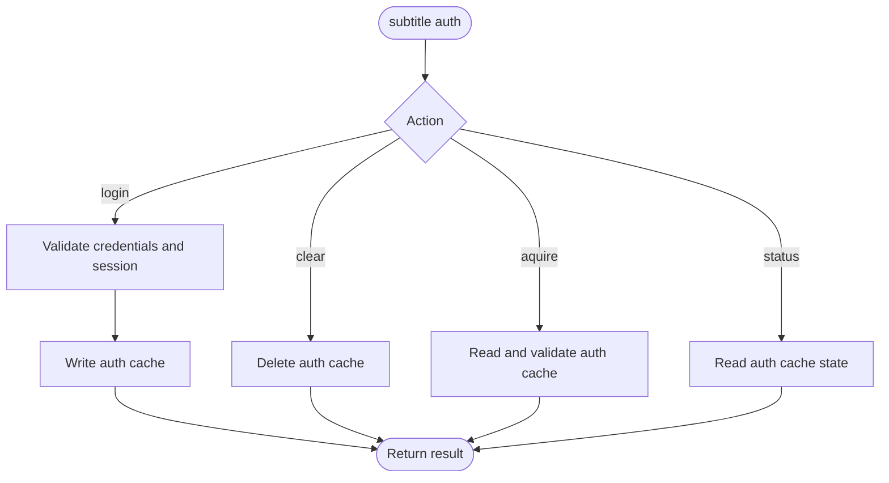
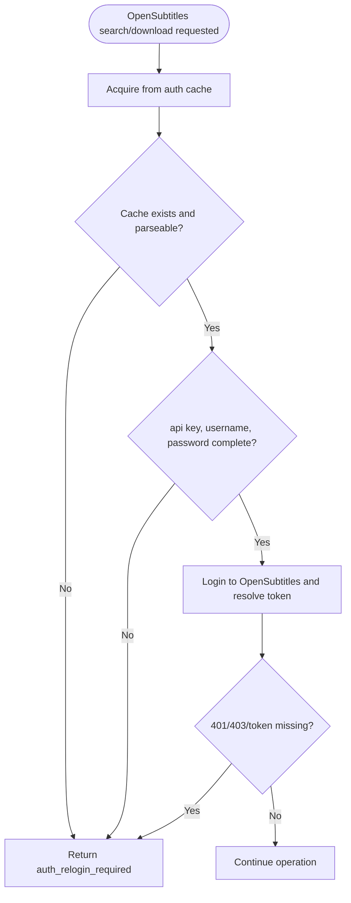

# OpenSubtitles Auth And Interface Design

Last updated: 2026-03-28

## Scope

This document records implementation-level design decisions for OpenSubtitles auth flow, CLI/MCP interfaces, and error contracts. It is intended for maintainers, not for skill prompt runtime.

## Design Goals

1. Remove per-call secret arguments from operational OpenSubtitles interfaces.
2. Keep auth state mutations explicit and minimal.
3. Ensure MCP and CLI return actionable relogin guidance when auth is unavailable.
4. Keep OpenSubtitles operation calls deterministic and cheap.

## Command Model

Auth command group:
1. `subtitle auth login`
2. `subtitle auth aquire`
3. `subtitle auth status`
4. `subtitle auth clear`

Behavior:
1. `login`
- required fields: `api-key`, `username`, `password`
- missing required values in interactive terminal are prompted
- password input is hidden (no echo)
- validates session via OpenSubtitles login endpoint before saving
- writes auth cache
2. `aquire`
- no arguments
- reads and validates auth state for current operation
- no disk write
3. `status`
- no arguments
- reports whether auth cache is present and complete
- no disk write
4. `clear`
- no arguments
- deletes auth cache

Mutation rule:
1. only `login` writes
2. only `clear` deletes
3. `aquire/status` and OpenSubtitles search/download are read-only

### Auth command mutation decision tree

## Credential Storage

Auth cache file:
1. `%LOCALAPPDATA%/SubtitleExtractslator/opensubtitles.auth.json`

Stored fields:
1. api key
2. username
3. password
4. endpoint
5. user agent
6. update time

Resolver behavior:
1. per-call optional overrides may replace endpoint and user agent
2. api key, username, and password come from auth cache

## OpenSubtitles Interface Changes

Operational surface (CLI + MCP):
1. `opensubtitles-search`
2. `opensubtitles-download`

Removed parameters:
1. api key
2. username
3. password

Remaining optional overrides:
1. endpoint
2. user agent

All operations resolve credentials through per-call `aquire` semantics.

## Auth preflight decision tree for operational calls

## Error Contract

Canonical auth error:
1. `code = auth_relogin_required`

Canonical guidance text:
1. `Run subtitle auth login and retry.`

MCP error payload:
1. `error.code`
2. `error.message`
3. `error.snapshotPath` (optional)
4. `error.guidance` (optional, stable for auth routing)
5. `error.timeUtc`

CLI behavior:
1. auth failures raise `OpenSubtitlesAuthException`
2. message includes explicit relogin guidance text

## Auth Failure Mapping

The following must map to relogin-required behavior:
1. auth cache missing or incomplete
2. login rejected (401)
3. permission denied (403)
4. token missing for protected endpoint
5. invalid cache parse

## Implementation Index

Core files:
1. `SubtitleExtractslator.Cli/OpenSubtitlesAuthStore.cs`
2. `SubtitleExtractslator.Cli/CliCommandRunner.cs`
3. `SubtitleExtractslator.Cli/McpTools.cs`
4. `SubtitleExtractslator.Cli/OpenSubtitlesAccessor.cs`
5. `SubtitleExtractslator.Cli/AppModels.cs`

Skill-facing docs intentionally omit internal rationale and focus on runtime contract.