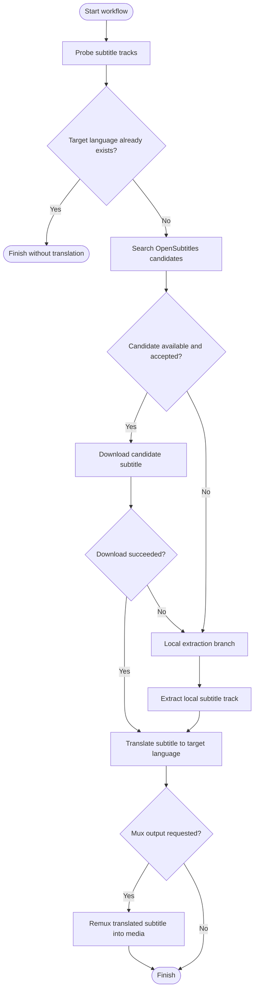

# System Architecture

## 1. Scope

SubtitleExtractslator is a skill-first repository with a runtime implementation in .NET.

- Skill package: `subtitle-extractslator/`
- Runtime implementation: `SubtitleExtractslator.Cli/`
- Tests: `SubtitleExtractslator.Tests/`

The current solution (`SubtitleExtractslator.sln`) contains two projects:

1. `SubtitleExtractslator.Cli` (`net9.0`, executable)
2. `SubtitleExtractslator.Tests` (`net9.0`, xUnit)

## 2. Runtime modes

The executable starts in one of two modes via `--mode`:

1. CLI mode (`--mode cli`, default)
2. MCP mode (`--mode mcp`)

### 2.1 CLI mode

Startup path:

1. `Program.cs` parses arguments via `AppOptions.Parse`.
2. Command dispatch is handled by `CliCommandRunner.RunAsync`.
3. Command handlers call `WorkflowOrchestrator` and lower-level services.
4. Result objects are serialized to JSON for output.

### 2.2 MCP mode

Startup path:

1. `Program.cs` builds a host via `Host.CreateApplicationBuilder`.
2. MCP server is registered with stdio transport and tools type `SubtitleMcpTools`.
3. Tools execute orchestrator operations and return structured `McpToolResult<T>` (`ok`, `data`, `error`).

## 3. High-level component architecture

Primary component responsibilities:

1. `AppOptions`: command-line argument parsing and help text.
2. `CliCommandRunner`: command routing, argument validation, and command-level adapters.
3. `WorkflowOrchestrator`: orchestration of probe/search/extract/translate/mux flows.
4. `SubtitleOperations`: media probing, extraction, SRT IO, OpenSubtitles search/download, mux operations.
5. `TranslationPipeline`: translation context construction, provider selection, output validation.
6. `ExternalTranslationProvider`: HTTP-based LLM translation in CLI mode.
7. `SamplingTranslationProvider`: MCP sampling translation in MCP mode.
8. `OpenSubtitlesAuthStore` + `OpenSubtitlesAccessor`: auth cache, login/token management, OpenSubtitles API calls.
9. `RuntimeInfrastructure` utilities: grouping, FFmpeg bootstrap, env overrides, response-size health guard, snapshot/logging.

## 4. Workflow architecture

## 4.1 Command-level workflow

Exposed CLI commands:

1. `probe`
2. `subtitle-timing-check`
3. `opensubtitles-search`
4. `opensubtitles-download`
5. `subtitle auth login|aquire|status|clear`
6. `extract`
7. `translate`
8. `translate-batch`

Notes:

1. `translate` is translation-only and requires SRT input.
2. `translate-batch` loops over an input list file and runs translation per item.
3. A full end-to-end `RunWorkflowAsync` path exists in `WorkflowOrchestrator` (probe/search/extract/translate/mux), but current CLI surface primarily exposes decomposed commands.
4. `subtitle-timing-check` compares media duration and subtitle last cue time, then returns whether the absolute difference is less than 10 minutes.

### 4.1.1 End-to-end decision tree (`RunWorkflowAsync`)

Notes:

1. Candidate acceptance prompt is CLI-interactive behavior.
2. MCP tool calls usually execute decomposed operations (`search`, `download`, `extract`, `translate`) instead of this single end-to-end path.

## 4.2 Translation-only flow

`WorkflowOrchestrator.TranslateAsync` performs:

1. Input validation (`.srt` required).
2. SRT load (`SubtitleOperations.LoadSrtAsync`).
3. Cue grouping (`GroupingEngine.Group`, default `cuesPerGroup=5`).
4. Group aggregation into translation units (`bodySize` default `20`).
5. Parallel unit translation (`SUBTITLEEXTRACTSLATOR_TRANSLATION_PARALLELISM`, default `4`).
6. Merge and save SRT (`SubtitleOperations.SaveSrtAsync`).
7. Structure validation (timeline/index preservation) before output acceptance.

## 4.3 Extraction flow

`SubtitleOperations.ExtractSubtitleAsync` branches by source and codec:

1. If input is SRT: copy-through extraction.
2. If subtitle codec is text-like: FFmpeg extraction to SRT.
3. If subtitle codec is bitmap (`hdmv_pgs_subtitle` or `dvd_subtitle`):
   - export SUP via FFmpeg
   - decode SUP to PNG timeline via `PgsSupDecoder`
   - OCR each frame (HTTP endpoint in CLI mode, MCP sampling in MCP mode)
   - rebuild SRT cues and persist output

## 5. OpenSubtitles architecture

## 5.1 Auth and credential resolution

Credential model:

1. Login/auth state is persisted by `OpenSubtitlesAuthStore` in local app data.
2. Operational commands resolve credentials through `Acquire(...)`.
3. API key/username/password come from cache; per-call overrides can adjust endpoint/user-agent.

## 5.2 API operations

`OpenSubtitlesAccessor` handles:

1. Login/token bootstrap (`/login`) and endpoint switching from returned `base_url`.
2. Search with query normalization and language fallback.
3. Download-link resolution (`/download`) followed by file download.
4. Rate-limit retries (up to 20 attempts with backoff / Retry-After support).
5. Debug block generation with secret redaction.

`SubtitleOperations.SearchOpenSubtitlesWithAccessorAsync` enforces staged search order:

1. primary query + target language
2. normalized query + target language
3. primary query + any language
4. normalized query + any language

## 6. Translation subsystem design

## 6.1 Context construction

`TranslationPipeline` builds a single-pass XML-like context envelope:

1. `<previous_context>`
2. `<main_section>` with indexed cue lines
3. `<following_context>`

Only main-section lines are translated; surrounding sections are context hints.

## 6.2 Provider policy by mode

1. CLI mode: `ExternalTranslationProvider` only.
2. MCP mode: `SamplingTranslationProvider` only.

In MCP mode, missing MCP server injection is treated as a hard error under sampling-only policy.

## 6.3 Structural guarantees

Validation rejects outputs if any invariant is violated:

1. cue count changed
2. cue index changed
3. start/end timestamps changed
4. translated cue has empty text lines

Output lines are wrapped by display width (`32`) with East Asian wide-character handling.

## 7. Runtime resilience and observability

## 7.1 Logging

`CliRuntimeLog` provides sequence-based runtime logs with scope timing.

Enable/disable behavior:

1. CLI logging controlled by `--quiet` and `SUBTITLEEXTRACTSLATOR_CLI_LOG`.
2. MCP logging controlled by `SUBTITLEEXTRACTSLATOR_MCP_LOG`.

## 7.2 Snapshots and diagnostics

`ErrorSnapshotWriter` writes structured failure snapshots and Markdown IO dumps to temp directories.

Used by:

1. top-level unhandled errors
2. MCP tool failures
3. LLM request/response diagnostics

## 7.3 Response-size health guard

`ResponseSizeHealthMonitor` maintains rolling response-size windows keyed by task/model/language.

Guard strategy:

1. hard cap: `64 KiB`
2. dynamic guard: up to `2.0x` rolling average for qualified samples
3. oversized response triggers retry path and concise-reasoning hint

## 8. Runtime dependency bootstrap

`FfmpegBootstrap` resolves FFmpeg binaries in this order:

1. `FFMPEG_BIN_DIR` override
2. known system locations
3. local app data download via `Xabe.FFmpeg.Downloader`

This keeps extraction/probing/mux operations portable across environments.

## 9. Configuration model

Configuration is primarily environment-variable driven, with optional command-level overrides.

Main groups:

1. translation provider (`LLM_*`, auth mode, retries)
2. workflow controls (`SUBTITLEEXTRACTSLATOR_*` grouping/parallelism/temp path)
3. OpenSubtitles credentials and endpoint behavior
4. FFmpeg binary resolution

Detailed matrix is documented in [Development and Operations](./development-and-operations.md).
