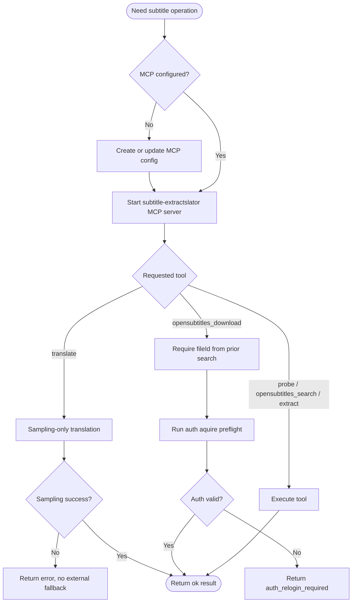

# MCP Reference

This file is skill-facing runtime contract only.
 
## MCP-First Policy

1. Prefer MCP mode first; CLI is fallback.
2. MCP translation path is sampling-only.
3. If sampling fails (including missing server injection), return error directly.
4. External/custom endpoint access (for example `LLM_ENDPOINT`) is CLI route only.
5. MCP tools must be invoked by the AI agent manually one-by-one in strict sequence (not human hand-operated steps).
6. For all MCP steps, do not execute tool calls through scripts/batch wrappers.
7. Subagent fanout is allowed if it runs through the agent path and preserves MCP sampling context.
8. Subagent fanout does not remove tool-level serial constraints (for example OpenSubtitles `search -> download`).

## MCP Setup Contract

1. Ask user whether to set up MCP in current workspace.
2. If agreed, create or update the MCP config file for the active agent client.
3. On all platforms, use absolute executable path for `servers.subtitle-extractslator.command`.
4. If config exists, merge/add server entry instead of overwriting unrelated servers.
5. Always choose the binary path that matches current OS and CPU architecture.

## MCP decision tree

## MCP Tools

1. `probe`
2. `subtitle_timing_check`
3. `opensubtitles_search`
4. `opensubtitles_download`
5. `extract`
6. `translate`

`subtitle_timing_check` behavior:
1. Compares media duration and subtitle last cue end time.
2. Returns whether `abs(video_duration - subtitle_last_cue_end) < 600 seconds`.
3. Uses ffprobe from FFmpeg toolchain internally.

`opensubtitles_download` behavior:
1. Requires `fileId` from a previous `opensubtitles_search` candidate.
2. Does not run search internally and does not support `candidateRank`.
3. Runs per-call auth acquire before each request.

OpenSubtitles parameter contract:
1. `opensubtitles_search` required parameters:
- `input`
- `lang`
- `searchQueryPrimary`
- `searchQueryNormalized`
2. `opensubtitles_download` required parameters:
- `fileId`
- `output`
3. Optional for both tools: `opensubtitlesEndpoint`, `opensubtitlesUserAgent`.
4. `translate` is translation-only and does not accept OpenSubtitles parameters.

Timing-check parameter contract:
1. `subtitle_timing_check` required parameters:
- `input`
- `subtitle`

`translate` behavior:
1. Translation-only path: no probe/search/download/extract/mux orchestration.
2. Required inputs: subtitle file input, target language, output path.
3. Optional translation controls: `cuesPerGroup`, `bodySize`, `llmRetryCount`.

`extract` behavior in MCP mode:
1. Non-bitmap subtitle extraction follows the same FFmpeg flow as CLI.
2. Bitmap subtitle branch (`hdmv_pgs_subtitle` / `dvd_subtitle`) runs SUP -> PNG+timeline in C# and OCR through MCP sampling.
3. This differs from CLI only at OCR source: MCP uses sampling, CLI uses configured local OpenAI-compatible endpoint.

`translate-batch` is intentionally not exposed in MCP mode due to timeout risk in common MCP clients.

## Tool Return Contract

1. All tools return structured object with `ok`, `data`, and `error`.
2. Success: `ok=true`, `data` contains payload.
3. Failure: `ok=false`, `error` contains `code`, `message`, optional `snapshotPath`, optional `guidance`, and `timeUtc`.
4. Auth failures must return:
- `code = auth_relogin_required`
- stable `guidance = Run subtitle auth login and retry.`
- `message` with explicit reason text for the current failure.

## Runtime Notes

1. MCP server is stdio and can appear idle while waiting for frames.
2. Logging must not break stdio protocol.
3. Use MCP client tool responses for status and errors.
4. OpenSubtitles credentials are resolved from `subtitle auth login` cache via per-call `subtitle auth aquire` semantics.
5. In MCP mode, do not commit secrets into repository files.
6. In MCP mode, keep orchestration agent-driven; allow subagent fanout but avoid script-driven tool loops.
